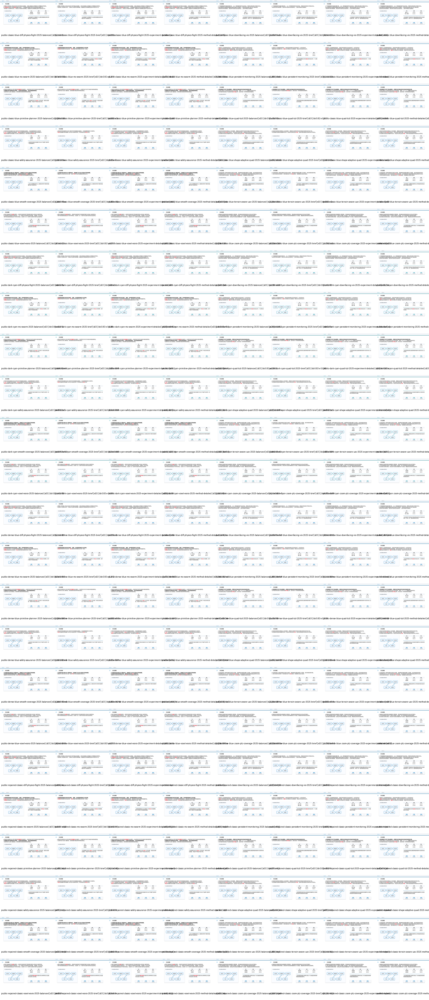
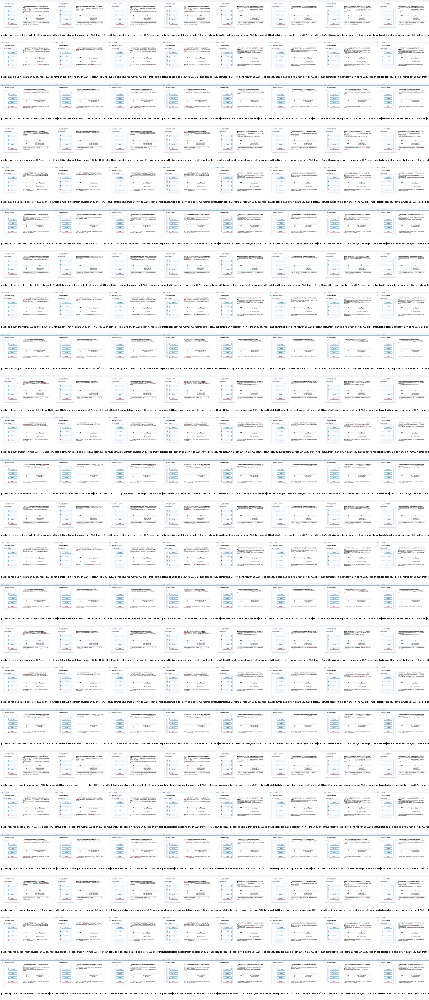
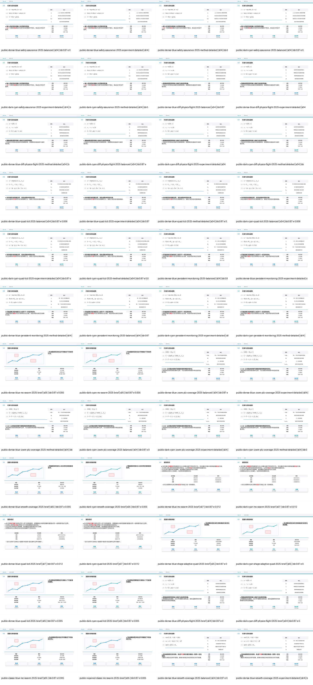
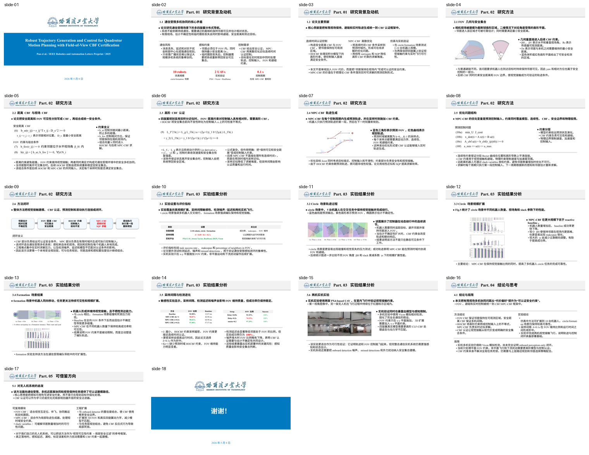
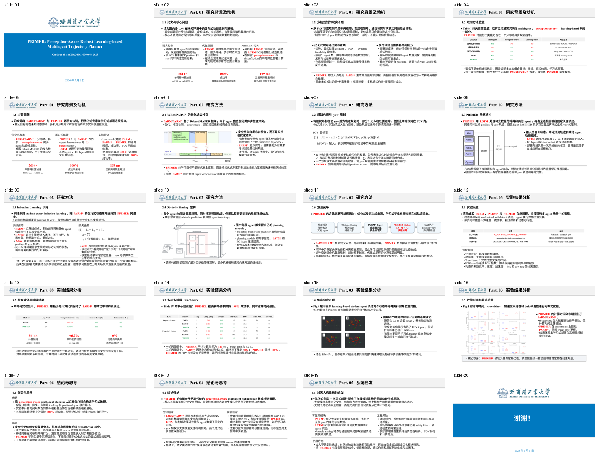
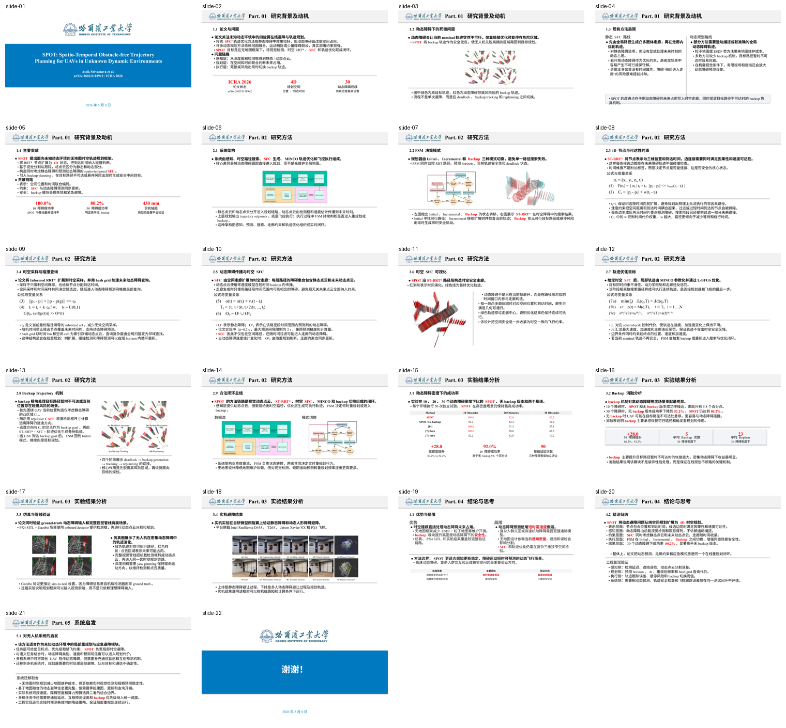

# paper2ppt

中文 | [English](#english)

## 中文

`paper2ppt` 目前整理的是一个面向论文汇报 PPT 生成的 Codex Skill：`uav-paper-report`。

它不是一个已经产品化的网页应用，也不是简单的 PDF 一键转 PPT。它更像是一套给 Codex 使用的论文汇报制作流程：读论文、理解模板、组织中文汇报内容、放置公式和图表、检查排版问题，并把这些经验沉淀成可复用的规则、脚本和示例。

当前重点服务无人机、机器人、轨迹规划、SLAM、控制、自主系统等方向的中文组会/论文汇报。其他学术方向也可以参考这套流程。

### 它适合做什么

- 读一篇无人机或机器人相关论文，生成中文组会汇报 PPT。
- 根据用户给出的历史 PPT 或模板，尽量沿用标题层级、颜色、页眉、横线、表格和结尾页风格。
- 控制内容详略：例如方法部分更详细、实验部分更简略，或者相反。
- 在正文中加入可讲清楚的公式、表格、方法流程、实验图和结果解释。
- 检查并修正常见问题：文字重叠、图片比例错误、无意义换行、空白过多、字体大小不统一、图文覆盖、公式排版混乱。
- 在公开上传前清理 PPTX 中的个人信息、备注、批注和文档元数据。

### 生成效果

下面是仓库中保留的公开示例截图。示例 PPT 都是 AI 生成并经过清理的结果，不包含私人模板或个人汇报信息。

| 多模板预览 | 方法页示例 |
| --- | --- |
|  |  |

| 公式页 | 图文页 | 空白检查样例 |
| --- | --- | --- |
|  |  |  |

| 强化学习方法图 | 实验结果表 | CBF 公式排版 |
| --- | --- | --- |
|  |  |  |

| FoV-CBF | PRIMER | SPOT |
| --- | --- | --- |
|  |  |  |

### 可以怎么控制内容

使用时可以直接说明你希望的内容安排，例如：

```text
使用 uav-paper-report skill，读这篇无人机论文，生成 20 页左右的中文组会汇报。
方法部分详细一些，需要公式和流程图；实验部分简略一些，但要说明每张图证明了什么。
```

也可以指定不同的详细程度：

- `brief`：页数更少，保留核心问题、方法和结论。
- `balanced`：背景、方法、实验和总结比较均衡。
- `method-detailed`：方法部分展开更多，公式和变量解释更充分。
- `experiment-detailed`：实验设置、指标、对比结果和消融分析更详细。

这套流程的目标不是把论文摘要机械拆成很多页，而是让每一页都能给别人讲清楚：论文做了什么、为什么这样做、结果说明了什么、方法有什么限制。

### 模板适配方式

当用户提供 PPT 模板或历史汇报时，推荐流程是：

1. 先观察模板尺寸、封面、结尾页、页眉、横线、主色和留白节奏。
2. 识别标题、一级正文、二级正文、表格、公式和注释的字号层级。
3. 判断模板更适合纵向堆叠、左右对照、图文并排、表格解释还是公式带状区域。
4. 根据论文内容选择版式，不把所有页面强行塞进同一种布局。
5. 生成后导出 PDF，再渲染为逐页 PNG，用真实页面检查重叠、溢出、图片裁剪和空白比例。

公开仓库不包含私人模板。这里保留的是可公开的示例、脚本、截图和配置。

### 安装

把 skill 目录复制到 Codex 的 skills 目录下：

```powershell
Copy-Item -Recurse -Force .\skills\uav-paper-report $env:USERPROFILE\.codex\skills\uav-paper-report
```

之后在 Codex 中提出类似请求即可：

```text
读一篇无人机轨迹规划论文，按照我给的 PPT 模板生成中文论文汇报。
```

### 运行环境

基础生成和检查通常需要：

- Python 3.10+
- `python-pptx`
- `Pillow`
- `PyMuPDF`
- LibreOffice，用于无界面导出 PDF

scaffold 依赖可参考：

```text
skills/uav-paper-report/assets/scaffolds/requirements.txt
```

### 质量标准

这个 skill 对 PPT 的要求比较明确：

- 正文默认使用 Times New Roman，字号层级要统一。
- 正文段落需要项目符号和合理缩进，不能靠空段落制造间距。
- 不允许在正文里手动插入无意义换行。
- 重点词和关键数字可以加粗或标红，但不能大面积整段标红。
- 公式尽量使用可编辑的 PPT 文本或 shape 组合，字号、行距和对齐要一致。
- 图片必须保持比例，不能拉伸、截断关键区域，也不能和文字或表格重叠。
- 普通内容页不能留下明显超过约 20% 的无意义空白。
- 表述要像正式论文汇报：说明论文做了什么、结果说明什么、方法限制在哪里。
- 不写给汇报人的提示话，正文只保留论文内容和结果解释。

这些规则来自多轮实际生成和修改中反复出现的问题：字体漂移、无意义换行、图文重叠、公式难看、空白过多、模板首尾页风格不一致等。

### 自动检查脚本

仓库提供了一些脚本，用来把常见问题自动化检查出来：

- `audit_pptx_text.py`：检查空文本框、手动换行、异常段落间距、字号漂移、越界 shape、可疑表述等。
- `scan_rendered_slides.py`：检查渲染后的 PNG 是否存在大面积空白、内部空白带、拥挤区域等。
- `render_pptx_previews.py`：把导出的 PDF 渲染成逐页 PNG 和预览图。
- `repair_pptx_layout.py`：发布前做机械清理，例如空文本体、部分字号漂移和正文换行。
- `run_template_matrix.py`：对公开示例做多论文、多模板回归检查。
- `run_template_smoke.py`：用本地模板批量生成压力测试页，检查多模板和多要求下的泛化能力。
- `sanitize_pptx_privacy.py`：清理 PPTX 元数据、备注、批注、自定义属性和可见个人信息。

多模板和多要求 smoke 测试示例：

```powershell
python .\skills\uav-paper-report\scripts\run_template_smoke.py `
  --templates .\skills\uav-paper-report\assets\template-profiles\public-template-smoke.json `
  --requirements .\skills\uav-paper-report\assets\template-profiles\requirement-smoke.json `
  --keep-going
```

如果只想重跑某个组合：

```powershell
python .\skills\uav-paper-report\scripts\run_template_smoke.py `
  --templates .\skills\uav-paper-report\assets\template-profiles\public-template-smoke.json `
  --requirements .\skills\uav-paper-report\assets\template-profiles\requirement-smoke.json `
  --template-id public-dark-cyan `
  --paper-id downfacing-vio-2025 `
  --requirement-id method-detailed
```

### 当前进度

仓库当前包含 8 个公开 AI 生成示例 PPTX，覆盖轨迹规划、强化学习导航、多机 CBF 规划、覆盖路径规划、FoV-CBF、PRIMER、SPOT 等方向。

最近一轮扩展 smoke 测试覆盖了 192 个生成组合，检查项包括 PPTX 文本审计、渲染页扫描、严格空白阈值扫描、正文换行检查、空段落检查和可疑表述检查。测试输出目录没有上传，仓库只保留可公开的示例和截图。

当前已经重点修正的问题包括：

- 文字和图片重叠。
- 字体大小不一致。
- 正文出现无意义换行或空段落。
- 图片比例、裁剪和说明不稳定。
- 公式区域过挤或过空。
- 表格比例不协调。
- 页面空白过多。
- 封面和结尾页颜色不一致。
- 公开文件残留个人信息。

### 后续目标

- 更自动地提取用户模板的版式、配色、字号层级和常用页面结构。
- 增加更明确的内容密度控制，让背景、方法、实验和总结分别控制详略。
- 改进 PowerPoint 原生公式生成，让复杂公式更接近正式 PPT 写法。
- 加强图片裁剪检测，减少子图被截断、caption 过多、比例异常等问题。
- 扩展到更多机器人和自主系统方向，例如 SLAM、控制、多智能体协同和机器人学习。
- 封装更完整的命令行流程：输入论文 PDF、模板 PPTX 和配置文件，输出 PPTX、PDF、PNG 预览和 QA 报告。

### 仓库结构

```text
paper2ppt/
├── README.md
├── LICENSE
└── skills/
    └── uav-paper-report/
        ├── SKILL.md
        ├── agents/openai.yaml
        ├── scripts/
        ├── references/
        └── assets/
            ├── examples/
            ├── scaffolds/
            ├── screenshots/
            └── template-profiles/
```

主要目录：

- `skills/uav-paper-report/SKILL.md`：Codex 使用该 skill 时读取的核心说明。
- `skills/uav-paper-report/references/`：更细的风格、依赖和 QA 检查说明。
- `skills/uav-paper-report/scripts/`：审计、渲染、修复、隐私清理和多模板测试脚本。
- `skills/uav-paper-report/assets/examples/`：已清理的 AI 生成示例 PPT。
- `skills/uav-paper-report/assets/scaffolds/`：可复用的 `python-pptx` 生成脚本。
- `skills/uav-paper-report/assets/screenshots/`：README 使用的效果截图。
- `skills/uav-paper-report/assets/template-profiles/`：多模板测试、压力测试和不同详细程度要求配置。

### 隐私说明

公开仓库不应包含私人模板、真实汇报人姓名、导师信息、课题组内部材料、备注页、批注作者或文档元数据。发布前建议运行：

```powershell
python .\skills\uav-paper-report\scripts\sanitize_pptx_privacy.py --check-only --fail-on-warning .\skills\uav-paper-report\assets\examples
```

## English

`paper2ppt` currently packages a Codex Skill named `uav-paper-report`.

It is not a polished web app and not a simple one-click PDF-to-PPT converter. It is a reusable workflow for Codex: read a paper, understand a PPT template, organize a Chinese academic report, place formulas and figures, check rendered slides, and keep the lessons in scripts, examples, and skill instructions.

The current focus is Chinese paper-report decks for UAV, robotics, trajectory planning, SLAM, control, and autonomous-systems papers. The workflow can also be adapted to other academic topics.

### What It Is Good For

- Generate a Chinese group-meeting or thesis-style report from a UAV or robotics paper.
- Reuse a user-provided PPT template or historical report style.
- Control the level of detail, such as a detailed method section and a shorter experiment section.
- Add formulas, tables, method flows, paper figures, and experiment interpretation into the deck body.
- Audit common layout problems: text overlap, bad image ratio, meaningless line breaks, excessive blank space, inconsistent font sizes, and messy formula layout.
- Sanitize PPTX metadata, notes, comments, and personal information before public upload.

### Example Outputs

The screenshots below are from public AI-generated examples. Private templates and personal report materials are not included.

| Multi-template preview | Method slide |
| --- | --- |
|  |  |

| Formula slide | Figure layout slide | Blank-space review |
| --- | --- | --- |
|  |  |  |

| RL method diagram | RL result table | CBF formula layout |
| --- | --- | --- |
|  |  |  |

### Detail Controls

You can ask for different report styles, for example:

```text
Use the uav-paper-report skill to read this UAV paper and create a 20-slide Chinese group-meeting deck.
Make the method section detailed with formulas and a flow diagram. Keep the experiment section concise,
but explain what each figure proves.
```

Supported requirement styles include:

- `brief`: fewer slides, focused on the core problem, method, and conclusion.
- `balanced`: balanced coverage of background, method, experiments, and summary.
- `method-detailed`: more method slides, formulas, and variable explanations.
- `experiment-detailed`: more experiment setup, metrics, comparisons, and ablation analysis.

The goal is not to mechanically split an abstract into slides. Each slide should have a clear claim, evidence, and interpretation.

### Template Adaptation

When a template or historical deck is available, the workflow is:

1. Inspect slide size, cover, ending slide, headers, rules, palette, and spacing rhythm.
2. Identify font levels for titles, body bullets, sub-bullets, tables, formulas, and notes.
3. Decide which layout families the template supports: vertical stack, left-right comparison, figure plus explanation, table plus interpretation, or formula band.
4. Choose slide layouts from the paper content instead of forcing every page into one pattern.
5. Export the generated PPTX to PDF, render slide PNGs, and inspect the real output for overlap, overflow, crop errors, and excessive blank space.

The public repository does not include private templates. It keeps only publishable examples, scripts, screenshots, and configuration files.

### Installation

Copy the skill folder into your Codex skills directory:

```powershell
Copy-Item -Recurse -Force .\skills\uav-paper-report $env:USERPROFILE\.codex\skills\uav-paper-report
```

Then ask Codex for a task like:

```text
Read this UAV trajectory-planning paper and generate a Chinese paper-report PPT using my template.
```

### Runtime

Basic generation and review usually need:

- Python 3.10+
- `python-pptx`
- `Pillow`
- `PyMuPDF`
- LibreOffice for headless PDF export

The scaffold dependency file is:

```text
skills/uav-paper-report/assets/scaffolds/requirements.txt
```

### Quality Expectations

The skill is opinionated about output quality:

- Body text should use a consistent font, currently Times New Roman by default.
- Font levels should stay fixed instead of changing slide by slide.
- Body paragraphs should use bullets and proper indentation.
- Empty paragraphs and manual body line breaks should not be used for spacing.
- Red or bold emphasis should stay on key terms and important numbers.
- Formulas should be editable PowerPoint text or shape-based components when possible.
- Images must preserve aspect ratio, keep important content visible, and avoid overlap.
- Normal content slides should not leave large meaningless blank regions.
- Wording should sound like a real academic report: state what the paper does, what the results show, and where the method is limited.
- Avoid presenter-advice phrases such as "key point to explain", "should emphasize", or "report wording".

### Automation Helpers

The repository includes scripts for recurring checks:

- `audit_pptx_text.py`: checks empty text bodies, manual newlines, abnormal paragraph spacing, font drift, out-of-bounds shapes, and suspicious wording.
- `scan_rendered_slides.py`: checks rendered PNGs for large blank areas, internal whitespace bands, and crowded regions.
- `render_pptx_previews.py`: renders exported PDFs into slide PNGs and preview grids.
- `repair_pptx_layout.py`: mechanically cleans empty text bodies, some font drift, and body newlines before publishing.
- `run_template_matrix.py`: runs public multi-paper, multi-template regression checks.
- `run_template_smoke.py`: generates stress decks across templates and requirement modes.
- `sanitize_pptx_privacy.py`: removes metadata, notes, comments, custom properties, and visible private information.

Example smoke test:

```powershell
python .\skills\uav-paper-report\scripts\run_template_smoke.py `
  --templates .\skills\uav-paper-report\assets\template-profiles\public-template-smoke.json `
  --requirements .\skills\uav-paper-report\assets\template-profiles\requirement-smoke.json `
  --keep-going
```

### Current Status

The repository currently includes 8 public AI-generated example PPTX decks covering trajectory planning, RL navigation, multi-quadrotor CBF planning, coverage path planning, FoV-CBF, PRIMER, SPOT, and related UAV/autonomy topics.

The latest expanded smoke pass covered 192 generated combinations. The checks included PPTX text audit, rendered-slide scan, strict blank-area thresholds, manual-line-break detection, empty-paragraph detection, and suspicious-wording detection. Full test output is not committed; the repository only keeps publishable examples and screenshots.

The workflow has been iterated around issues that repeatedly appeared in real use:

- Text and image overlap.
- Inconsistent body font sizes.
- Meaningless line breaks and empty paragraphs.
- Unstable image crop and aspect ratio.
- Formula regions that are too crowded or too sparse.
- Poor table proportions.
- Excessive blank space.
- Inconsistent cover and ending-slide styling.
- Personal information left in public files.

### Roadmap

- Extract template layout, palette, font hierarchy, and common slide structures more automatically.
- Add clearer content-density controls for background, method, experiments, and summary.
- Improve native PowerPoint formula generation for more standard academic equation layout.
- Strengthen figure-crop QA for truncated subfigures, caption-heavy crops, and aspect-ratio errors.
- Expand examples to more robotics and autonomous-systems topics, including SLAM, control, multi-agent coordination, and robot learning.
- Package a fuller CLI workflow: input PDF, template PPTX, and config file; output PPTX, PDF, PNG previews, and QA report.

### Repository Layout

```text
paper2ppt/
├── README.md
├── LICENSE
└── skills/
    └── uav-paper-report/
        ├── SKILL.md
        ├── agents/openai.yaml
        ├── scripts/
        ├── references/
        └── assets/
            ├── examples/
            ├── scaffolds/
            ├── screenshots/
            └── template-profiles/
```

Key paths:

- `skills/uav-paper-report/SKILL.md`: core instructions loaded by Codex.
- `skills/uav-paper-report/references/`: detailed style, dependency, and QA notes.
- `skills/uav-paper-report/scripts/`: audit, render, repair, privacy, and multi-template scripts.
- `skills/uav-paper-report/assets/examples/`: sanitized AI-generated example PPT decks.
- `skills/uav-paper-report/assets/scaffolds/`: reusable `python-pptx` generation scripts.
- `skills/uav-paper-report/assets/screenshots/`: screenshots used in this README.
- `skills/uav-paper-report/assets/template-profiles/`: multi-template, stress-test, and requirement-variant configuration.

### Privacy

Public assets should not contain private templates, real presenter names, advisor information, internal group materials, notes slides, comment authors, or document metadata. Before publishing, run:

```powershell
python .\skills\uav-paper-report\scripts\sanitize_pptx_privacy.py --check-only --fail-on-warning .\skills\uav-paper-report\assets\examples
```
