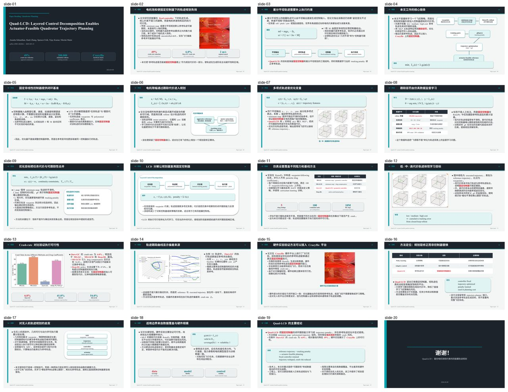
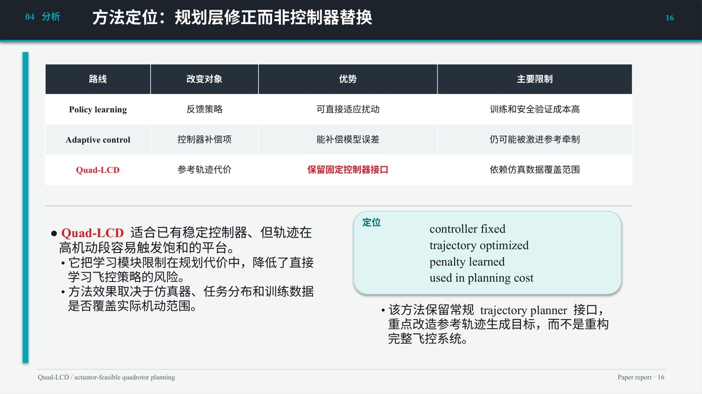
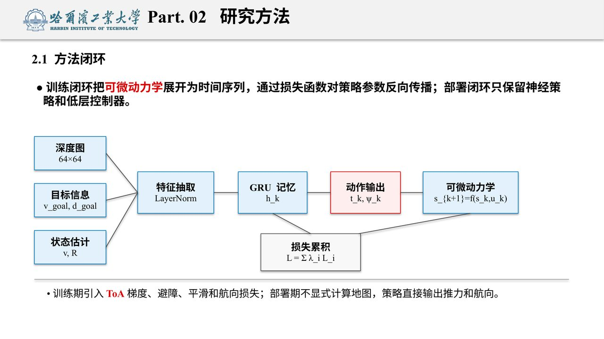
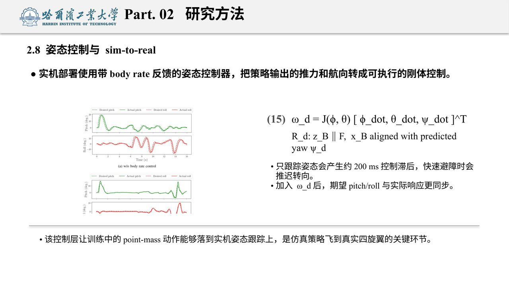
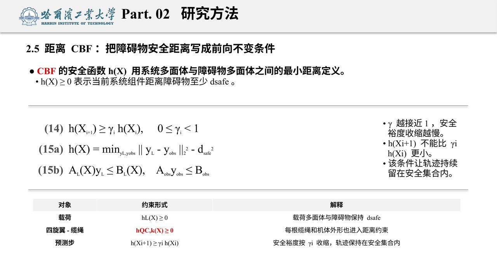

# paper2ppt

中文 | [English](#english)

## 中文

### 本次质量更新

- 新增更严格的 PPTX 文本与布局审计：会检查空文本体、混合空段、正文手动换行、段落异常间距、窄公式长行、内容 shape 重叠、正文字号漂移和越界 shape。
- 正文字号必须使用固定层级，不能为了塞内容在不同页随意调大调小。
- 普通正文不能依赖空段落、空文本框或手动换行制造间距；需要通过区域宽度、段落间距和页面重排解决。
- scaffold 默认拒绝正文中的 `\n`，只允许封面标题或显式图示节点使用有意分行；公式长行需要拆成稳定短行。
- 新生成的报告建议使用 `audit_pptx_text.py --strict-body-hierarchy --fail-on-warning`，公开示例也已清理空文本体。
- 生成后必须按顺序完成：PPTX 审计、LibreOffice 导出、PNG 渲染、渲染页扫描和风险页人工检查。

`paper2ppt` 收录了一个用于论文汇报 PPT 生成与审查的 Codex Skill：`uav-paper-report`。它面向无人机、机器人、规划、SLAM、控制和自主系统方向的中文组会/论文汇报，目标是支持“给定论文 + 给定 PPT 模板/示例风格”的多模板生成，而不是固定在单一版式上。当前重点是让生成结果保持风格一致、内容密度足够、公式和图表可讲、图片裁剪干净，并通过渲染后的视觉 QA 反复检查。

公开仓库只保留 AI 生成示例、生成脚本、截图和审查脚本；不包含原始私有模板或任何个人汇报材料。

### 效果截图

| 多模板预览 | 方法定位页 |
| --- | --- |
|  |  |

| RL 方法图 | RL 结果表 | CBF 公式排版 |
| --- | --- | --- |
|  |  |  |

### 仓库内容

```text
paper2ppt/
├─ README.md
├─ LICENSE
└─ skills/
   └─ uav-paper-report/
      ├─ SKILL.md
      ├─ agents/openai.yaml
      ├─ scripts/
      ├─ references/
      └─ assets/
         ├─ examples/
         ├─ scaffolds/
         └─ screenshots/
```

### Skill 能做什么

- 根据论文 PDF 和用户提供的 PPT 风格生成中文学术汇报 PPT。
- 复用不同模板/示例的视觉风格，包括封面、结尾页、页眉、横线、字体层级、配色、表格和公式区。
- 生成较完整的论文汇报结构：背景、技术要点、方法、公式、实验、局限和总结。
- 使用原生 PPT 文本、表格、形状和可编辑公式表达，避免把整页做成截图。
- 对图片裁剪、比例、图文间距、空白区域、重叠、无意义换行和 AI 化表述进行检查。
- 发布或上传前清理 PPTX 示例和生成结果中的个人信息、备注、批注和文档元数据。
- 提供已验证的 scaffold 脚本和示例 PPT，便于复用。

### 当前进度

- 已整理 4 份公开 AI 生成示例 PPTX，覆盖轨迹规划、强化学习导航、多机 CBF 规划和多机覆盖路径规划等方向。
- 已形成可复用的 `python-pptx` scaffold，包括封面/结尾、正文项目符号、公式行、原生表格、流程图、图片裁剪和指标条。
- 已支持多模板风格迁移的工作流：先读取用户模板或示例 deck，再按其版式节奏生成新论文汇报。
- 已加入严格 PPTX 审计：空文本体、正文手动换行、异常段落间距、窄公式长行、内容重叠、字体层级漂移和越界 shape。
- 已加入隐私清理：发布前清理 PPTX 元数据、备注、批注和可见个人信息。

### 后续目标

- 增加模板抽取脚本，自动读取用户 PPTX 的封面、页眉、字体层级、配色、表格样式和常用版式。
- 增加“详细/简略”内容密度参数，让背景、方法、实验和总结部分可以按用户要求扩写或压缩。
- 改进公式生成，尽量使用更标准的 PowerPoint 原生公式或更稳定的可编辑公式组件。
- 增加图片裁剪质量检测，自动发现比例异常、截断子图、caption 过多和图文重叠。
- 增加更多论文领域模板，包括 SLAM、控制、路径规划、机器人学习和多智能体协同。
- 封装更完整的命令行流程：输入 PDF、模板 PPTX 和配置文件，输出 PPTX、PDF、PNG 预览和 QA 报告。

### 安装方式

把 skill 目录复制到 Codex 的 skills 目录下：

```powershell
Copy-Item -Recurse -Force .\skills\uav-paper-report $env:USERPROFILE\.codex\skills\uav-paper-report
```

安装后，在 Codex 中提出类似请求时会触发：

```text
读一篇无人机相关论文，生成中文论文汇报 PPT。
```

### 依赖

基础依赖通常包括：

- Python 3.10+
- `python-pptx`
- `Pillow`
- `PyMuPDF`
- LibreOffice，用于 headless 导出 PDF

scaffold 的 Python 依赖可参考：

```text
skills/uav-paper-report/assets/scaffolds/requirements.txt
```

### 推荐工作流

1. 先阅读论文，提取问题、技术要点、方法公式、算法流程、实验结果和局限。
2. 参考示例 PPT 或用户私有模板，规划 18-24 页左右的中文汇报结构。
3. 裁剪论文图像，排除页边距、正文、完整 caption 和被截断的子图。
4. 用 scaffold 脚本生成可编辑 PPTX。
5. 用 LibreOffice 导出 PDF。
6. 将 PDF 渲染为逐页 PNG 和 preview grid。
7. 运行文本审查和渲染扫描脚本。
8. 人工检查公式页、图片页、表格页和本轮修改过的页面。
9. 如果要提交到公开仓库，先运行隐私清理脚本并检查示例和生成结果 PPTX。

### 质量规则

该 skill 特别关注以下问题：

- 正文字体统一使用 Times New Roman。
- 普通正文需要项目符号和正确缩进，不保留无意义空行。
- 关键术语和关键数字可以加粗/标红，但不能大面积红字。
- 公式应尽量用 PPT 原生文本/shape 方式表达，并保持字号统一。
- 图片必须保持比例，不能和文字重叠，也不能裁掉关键内容。
- 每页不应留下明显超过 20% 的无意义空白。
- 文字表述应像正常论文汇报，只介绍论文做了什么、实验显示什么、方法有什么限制；避免“讲解重点”“应该强调”“如果继续”等提示式语言。
- 公开示例和生成结果不能包含真实汇报人姓名、作者/修改者元数据、备注页、批注作者或自定义属性。

### 主要脚本

- `scripts/audit_pptx_text.py`：检查 AI 化表述、空文本体、混合空段、手动换行、异常段落间距、公式行宽度、内容重叠、字号异常、严格字号层级和越界 shape。
- `scripts/sanitize_pptx_privacy.py`：清理 PPTX 个人信息、备注、批注、自定义属性和可见汇报人姓名。
- `scripts/render_pptx_previews.py`：把导出的 PDF 渲染为逐页 PNG 和 preview grid。
- `scripts/scan_rendered_slides.py`：扫描空白过多、拥挤和异常空白带。
- `scripts/check_dependencies.py`：检查基础依赖。

上传前建议执行：

```powershell
python .\skills\uav-paper-report\scripts\sanitize_pptx_privacy.py --in-place .\skills\uav-paper-report\assets\examples --replace "：原姓名=：报告人" --forbid "原姓名"
python .\skills\uav-paper-report\scripts\sanitize_pptx_privacy.py --check-only --fail-on-warning .\skills\uav-paper-report\assets\examples --forbid "原姓名"
```

### 示例

- `assets/examples/`：AI 生成并检查过的示例 PPT。
- `assets/examples/*.pptx`：已经验证过的示例 PPT。
- `assets/scaffolds/*.py`：可复用的生成脚本。

### 说明

这个仓库不是一个完整产品化的“论文转 PPT”应用，而是一个可复用的 Codex Skill 包。它适合在 Codex 中作为生成和审查流程使用，也可以把 scaffold 脚本单独拿出来改造成自己的生成流程。

## English

### Quality Update

- Added stricter PPTX text/layout auditing for empty text bodies, mixed empty paragraphs, manual body newlines, abnormal paragraph spacing, long formula rows in narrow boxes, content-shape overlap, body font hierarchy drift, and out-of-bounds shapes.
- Body text must use a fixed hierarchy across the deck instead of changing slide by slide to force content to fit.
- Normal body spacing must come from layout geometry and paragraph spacing, not empty paragraphs, empty text boxes, or manual line breaks.
- Scaffolds now reject `\n` in body text by default. Only cover titles or explicit diagram nodes should use intentional multi-line text; long formula rows must be split into stable short rows.
- New generated decks should run `audit_pptx_text.py --strict-body-hierarchy --fail-on-warning`; public examples have also been cleaned of empty text bodies.
- Each generated deck should pass, in order: PPTX audit, LibreOffice export, PNG rendering, rendered-slide scan, and manual risk-slide inspection.

`paper2ppt` contains a Codex Skill named `uav-paper-report` for generating and auditing academic paper-report PowerPoint decks. It is designed for Chinese group-meeting or thesis-style reports on UAVs, robotics, planning, SLAM, control, and autonomous systems. The goal is multi-template generation from a paper plus a user-provided PPT template or example style, rather than a single fixed layout. The workflow emphasizes style fidelity, content density, editable formulas, clean figure crops, layout checks, and rendered visual QA.

The public repository keeps only AI-generated example decks, screenshots, generation scaffolds, and QA scripts. It does not include the original private report template or personal report materials.

### Screenshots

| Multi-template preview | Method positioning slide |
| --- | --- |
|  |  |

| RL method diagram | RL result table | CBF formula layout |
| --- | --- | --- |
|  |  |  |

### Repository Contents

```text
paper2ppt/
├─ README.md
├─ LICENSE
└─ skills/
   └─ uav-paper-report/
      ├─ SKILL.md
      ├─ agents/openai.yaml
      ├─ scripts/
      ├─ references/
      └─ assets/
         ├─ examples/
         ├─ scaffolds/
         └─ screenshots/
```

### What The Skill Does

- Generates Chinese academic presentation decks from a paper PDF and a user-provided presentation style.
- Reuses different template/example styles, including cover, closing slide, header, rules, type hierarchy, palette, tables, and formula regions.
- Builds a complete report structure: background, technical points, method, formulas, experiments, limitations, and summary.
- Uses editable PowerPoint-native text, tables, shapes, and formula-like text instead of slide screenshots.
- Checks figure crops, aspect ratios, text-image spacing, blank areas, overlap, meaningless line breaks, font hierarchy drift, empty text bodies, and AI-sounding wording.
- Sanitizes PPTX examples and generated outputs before publishing by removing personal information, notes, comments, and document metadata.
- Provides validated scaffold scripts and example decks for reuse.

### Current Progress

- Collected 4 public AI-generated example PPTX decks covering trajectory planning, RL navigation, multi-quadrotor CBF planning, and multi-UAV coverage path planning.
- Built reusable `python-pptx` scaffolds for covers, closing slides, bullet hierarchy, formula rows, native tables, process diagrams, figure crops, and metric rows.
- Established a multi-template workflow: inspect the user template or example deck first, then generate a new paper report following its visual rhythm.
- Added strict PPTX auditing for empty text bodies, manual body newlines, abnormal paragraph spacing, long formula rows in narrow boxes, content overlap, font hierarchy drift, and out-of-bounds shapes.
- Added privacy sanitization for PPTX metadata, notes, comments, and visible personal information before public release.

### Roadmap

- Add template extraction scripts for cover style, header rhythm, font hierarchy, palette, table style, and common layout families.
- Add content-density controls so background, method, experiment, and conclusion sections can be expanded or compressed.
- Improve formula generation with more standard PowerPoint-native equations or more stable editable formula components.
- Add stronger figure-crop QA for aspect ratio errors, truncated subfigures, caption-heavy crops, and text-image collisions.
- Add more domain templates for SLAM, control, path planning, robot learning, and multi-agent systems.
- Package a fuller CLI workflow: input PDF, template PPTX, and config file; output PPTX, PDF, PNG previews, and QA report.

### Installation

Copy the skill directory into your Codex skills folder:

```powershell
Copy-Item -Recurse -Force .\skills\uav-paper-report $env:USERPROFILE\.codex\skills\uav-paper-report
```

After installation, prompts like this should trigger the skill:

```text
Read a UAV-related paper and generate a Chinese paper-report PPT.
```

### Dependencies

Typical dependencies include:

- Python 3.10+
- `python-pptx`
- `Pillow`
- `PyMuPDF`
- LibreOffice for headless PDF export

See the scaffold dependency file:

```text
skills/uav-paper-report/assets/scaffolds/requirements.txt
```

### Recommended Workflow

1. Read the paper and extract the problem, technical points, method equations, algorithm flow, experiments, and limitations.
2. Inspect the example decks or a private user template, then plan an 18-24 slide Chinese report.
3. Crop paper figures cleanly, excluding margins, body text, full captions, and truncated subfigures.
4. Generate an editable PPTX from a scaffold script.
5. Export the PPTX to PDF with LibreOffice.
6. Render the PDF into per-slide PNG previews and a preview grid.
7. Run text audit and rendered-slide scan scripts.
8. Manually inspect formula slides, image-heavy slides, tables, and any edited in this pass pages.
9. Before committing to a public repository, sanitize and check all example/generated PPTX assets.

### Quality Rules

This skill focuses on the following issues:

- Use Times New Roman consistently for body text.
- Body paragraphs need bullets and proper indentation; meaningless blank lines, empty text bodies, and manual body newlines should not remain.
- Body font sizes should use a fixed hierarchy across the deck instead of changing slide by slide to force content to fit.
- Key terms and numbers may be bold/red, but most text should stay black.
- Formulas should preferably be editable PowerPoint-native text/shapes with consistent sizing.
- Images must preserve aspect ratio, avoid text overlap, and keep important content visible.
- Normal content slides should not leave more than about 20% meaningless blank area.
- Wording should sound like a normal academic report: state what the paper does, what experiments show, and what limitations remain. Avoid presenter-advice phrases such as "key point to explain", "should emphasize", or "future-work advice".
- Public examples and generated outputs must not contain real presenter names, author/editor metadata, notes slides, comment authors, or custom properties.

### Main Scripts

- `scripts/audit_pptx_text.py`: checks AI-sounding wording, empty text bodies, mixed empty paragraphs, manual line breaks, abnormal paragraph spacing, formula row width, content overlap, font-size anomalies, strict body hierarchy, and out-of-bounds shapes.
- `scripts/sanitize_pptx_privacy.py`: removes PPTX personal information, notes, comments, custom properties, and visible presenter names.
- `scripts/render_pptx_previews.py`: renders exported PDFs into slide PNGs and a preview grid.
- `scripts/scan_rendered_slides.py`: scans for excessive blank space, crowding, and large internal whitespace bands.
- `scripts/check_dependencies.py`: checks basic runtime dependencies.

Recommended pre-upload commands:

```powershell
python .\skills\uav-paper-report\scripts\sanitize_pptx_privacy.py --in-place .\skills\uav-paper-report\assets\examples --replace ": Real Name=: Presenter" --forbid "Real Name"
python .\skills\uav-paper-report\scripts\sanitize_pptx_privacy.py --check-only --fail-on-warning .\skills\uav-paper-report\assets\examples --forbid "Real Name"
```

### Examples

- `assets/examples/`: AI-generated and checked example decks.
- `assets/examples/*.pptx`: validated example decks.
- `assets/scaffolds/*.py`: reusable generation scripts.

### Notes

This repository is not a full productized paper-to-PPT application. It is a reusable Codex Skill package. It is intended to guide Codex through generation and QA, and the scaffold scripts can also be adapted into your own generation pipeline.
